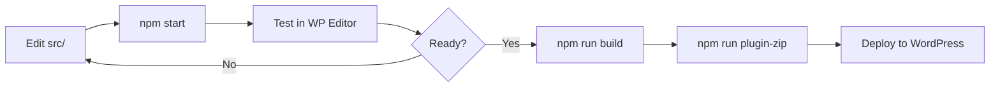

# 🧱 Twork Builder

> **Professional WordPress Gutenberg Blocks Plugin** — purpose-built for the Twork Ecosystem  
> Enterprise-grade page building blocks for hospitals, clinics, corporate sites, and e-commerce.

[](https://www.gnu.org/licenses/gpl-2.0.html)
[](https://wordpress.org/)
[](https://www.php.net/)
[](https://nodejs.org/)
[](https://developer.wordpress.org/block-editor/)

---

## 📋 Table of Contents

- [Overview](#-overview)
- [Key Features](#-key-features)
- [Requirements](#-requirements)
- [Quick Start](#-quick-start)
- [Project Structure](#-project-structure)
- [Block Catalog](#-block-catalog)
- [Available Scripts](#-available-scripts)
- [Development Workflow](#-development-workflow)
- [Block Architecture](#-block-architecture)
- [PHP Render Callbacks](#-php-render-callbacks)
- [Frontend Assets](#-frontend-assets)
- [HTML Page Templates](#-html-page-templates)
- [Deployment](#-deployment)
- [Troubleshooting](#-troubleshooting)
- [Contributing](#-contributing)
- [Commit Convention](#-commit-convention)
- [License & Support](#-license--support)

---

## 🌟 Overview

**Twork Builder** is a production-ready WordPress plugin that delivers **250+ custom Gutenberg blocks** for building modern, responsive websites within the Twork Ecosystem. It powers hospital portals, corporate marketing sites, pharmacy shops, CSR pages, and specialty department layouts — all editable through the native WordPress Block Editor.

Built with **ES6+**, **SCSS**, **@wordpress/scripts**, and **WordPress best practices**, the plugin is designed for:

- 🏥 **Healthcare & hospital websites** — departments, doctors, health checks, emergency units
- 🥑 **Agrezer / Avocado brand sites** — hero sections, stats, testimonials, shop grids
- 🛒 **WooCommerce integration** — pharmacy categories, popular products, shop layouts
- 🏢 **Corporate & CSR pages** — mission/vision, awards, events, initiatives
- 📱 **Fully responsive layouts** — mobile-first SCSS with editor/frontend parity

---

## ✨ Key Features

| Feature | Description |
|---------|-------------|
| 🎨 **250+ Custom Blocks** | Pre-built sections, cards, grids, heroes, FAQs, timelines, and more |
| 🚀 **Modern Dev Stack** | ES6+, SCSS, Webpack via `@wordpress/scripts` |
| 📦 **Production Builds** | Minified bundles, PHP copy to `build/`, plugin ZIP generator |
| 🔧 **Developer Tooling** | Watch mode, linting, migration scripts, block validation gates |
| 📱 **Responsive by Default** | Mobile-first SCSS with fluid spacing and breakpoint-aware layouts |
| ⚡ **Performance Focused** | Conditional script enqueue, scoped block styles, optimized builds |
| 🧩 **Dynamic PHP Blocks** | Server-side render callbacks for blog, shop, updates, and CPT-driven content |
| 🎯 **Editor Experience** | Dedicated block category, inspector controls, editor-only styles |
| 🗂️ **Deprecated Block Support** | Legacy blocks preserved under `src/deprecated/` for safe migration |

---

## 📦 Requirements

| Dependency | Minimum Version |
|------------|-----------------|
| **WordPress** | 6.0+ |
| **PHP** | 7.4+ |
| **Node.js** | 18.0+ |
| **npm** | 9.0+ |

**Optional integrations:**

- 🛒 **WooCommerce** — required for pharmacy and Agrezer shop blocks
- 📰 **Custom Post Types** — Awards, CSR Initiatives, Emergency Units (included in plugin)

---

## 🚀 Quick Start

### 1️⃣ Clone the Repository

```bash
git clone https://github.com/mawkunnmyat/twork-builder.git
cd twork-builder
```

### 2️⃣ Install Dependencies

```bash
npm install
```

### 3️⃣ Development Mode (Watch)

```bash
npm start
```

Starts the development build with **hot reload** — recompiles automatically on file changes in `src/`.

### 4️⃣ Production Build

```bash
npm run build
```

Builds minified, optimized assets into `build/`. Uses **8 GB Node heap** by default to handle the large block set.

> 💡 **Out of memory?** Run:
> ```bash
> NODE_OPTIONS=--max-old-space-size=8192 npm run build
> ```

### 5️⃣ Create Plugin ZIP

```bash
npm run plugin-zip
```

Generates `../twork-builder.zip` — ready for WordPress upload.

### 6️⃣ Install in WordPress

**Via Admin Dashboard:**

`Plugins → Add New → Upload Plugin → twork-builder.zip → Activate`

**Via WP-CLI:**

```bash
wp plugin install twork-builder.zip --activate
```

---

## 📁 Project Structure

```
twork-builder/
├── 📂 src/                          # Block source (ES6, SCSS, block.json)
│   ├── agrezer-*/                   # Agrezer / Avocado brand blocks
│   ├── health-check-*/              # Health check package blocks
│   ├── em-*/                        # Emergency department blocks
│   ├── rad-*/                       # Radiology & imaging blocks
│   ├── phy-*/                       # Physiotherapy blocks
│   ├── ph-*/                        # Pharmacy / WooCommerce blocks
│   ├── csr-*/                       # CSR & community blocks
│   ├── deprecated/                  # Legacy blocks (migration-safe)
│   └── global.scss                  # Shared global stylesheet
├── 📂 build/                        # Compiled output (generated — do not edit)
├── 📂 assets/
│   ├── images/                      # Static image assets
│   └── js/                          # Frontend init scripts (conditionally enqueued)
├── 📂 includes/                     # PHP classes & render callbacks
│   ├── class-twork-award.php
│   ├── class-twork-blog-section.php
│   ├── class-twork-csr-initiative.php
│   ├── class-twork-em-units-section.php
│   ├── class-twork-ph-shop-category-section.php
│   ├── class-twork-ph-popular-products-section.php
│   ├── class-twork-agrezer-shop-grid-section.php
│   ├── class-twork-phy-facilities-section.php
│   └── class-twork-updates-section.php
├── 📂 scripts/                      # Dev & migration utilities
├── 📄 *.html                        # Static page layout references
├── 📄 twork-builder.php             # Main plugin bootstrap
├── 📄 webpack.config.js             # Custom Webpack / Sass config
├── 📄 create-zip.sh                 # Production ZIP creator
├── 📄 package.json
└── 📄 README.md
```

---

## 🧩 Block Catalog

Blocks are registered automatically from `build/` and appear under **"Twork Builder Blocks"** in the Gutenberg inserter.

### 🥑 Agrezer / Avocado Brand

Hero sections, about pages, stats, testimonials, partners, process flows, shop grids, blog layouts, contact cards, greener/sustainability sections, and why-choose layouts.

```
agrezer-hero-section · agrezer-about-section · agrezer-stats-section
agrezer-testimonials-section · agrezer-partners-section · agrezer-shop-grid-section
agrezer-why-choose-section · agrezer-voices-section · agrezer-blog-section · …
```

### 🏥 Hospital & Clinical

Department layouts, centre pages, doctor directories, emergency units, neuro/radiology/physio sections, health check packages, and patient guides.

```
emergency-hero · doctor-search-filter-section · health-check-packages-section
neuro-centre-section · rad-stats-section · phy-conditions-section · paediatrics-hero · …
```

### 🛒 Pharmacy & E-Commerce

WooCommerce-powered shop categories, popular products, and Agrezer product grids.

```
ph-shop-category-section · ph-popular-products-section · agrezer-shop-grid-section
```

### 🌍 CSR & Corporate

Awards, initiatives, events, moments gallery, mission/vision, accreditations, and team sections.

```
csr-initiatives-section · csr-events-section · csr-stats-section
accreditation-section · mission-vision-grid · team-members-grid · …
```

### 🧱 Layout & Utility

Containers, page heroes, timelines, story grids, feature sections, navigation, and shared structural blocks.

```
container · page-hero · timeline · story-grid · features-section · twork-nav-item · …
```

> 📌 **Tip:** Run `npm run add-block-examples` to scaffold block example metadata across the codebase.

---

## 🛠️ Available Scripts

| Command | Description |
|---------|-------------|
| `npm start` | 🔁 Development mode with watch & hot reload |
| `npm run build` | 📦 Production build (minified, PHP copied to `build/`) |
| `npm run plugin-zip` | 🗜️ Build + create WordPress-ready ZIP |
| `npm run zip` | 🗜️ Create ZIP only (requires prior build) |
| `npm run lint:js` | 🔍 Lint JavaScript with WordPress standards |
| `npm run lint:css` | 🎨 Lint SCSS/CSS with stylelint |
| `npm run format` | ✨ Auto-format JavaScript files |
| `npm run packages-update` | ⬆️ Update `@wordpress/*` packages |
| `npm run add-block-examples` | 📝 Add block example metadata |
| `npm run gate-inspector-is-selected` | ✅ Validate inspector `isSelected` usage |
| `npm run migrate-stable-block-props` | 🔄 Migrate stable block prop patterns |

---

## 🔄 Development Workflow



1. ✏️ **Edit** block files in `src/<block-name>/`
2. 🔁 **Watch** with `npm start` during development
3. 🧪 **Test** in the WordPress Block Editor and on the frontend
4. 📦 **Build** with `npm run build` before release
5. 🗜️ **Package** with `npm run plugin-zip` for deployment
6. 🚀 **Deploy** via WordPress admin or WP-CLI

---

## 🏗️ Block Architecture

Each block in `src/` follows a consistent, WordPress-standard structure:

```
src/my-block/
├── block.json          # 📋 Metadata, attributes, supports, asset handles
├── index.js            # 🔌 Block registration entry point
├── edit.js             # ✏️  Editor component (React)
├── save.js             # 💾 Frontend save output (or null for dynamic blocks)
├── style.scss          # 🎨 Frontend styles
├── editor.scss         # 🖥️  Editor-only styles (optional)
├── view.js             # ⚡ Frontend JavaScript (optional)
└── render.php          # 🐘 Server-side render (dynamic blocks only)
```

### Build Pipeline

`@wordpress/scripts` + custom `webpack.config.js`:

- ✅ Compiles SCSS → CSS with modern Sass API
- ✅ Bundles JavaScript via Webpack
- ✅ Minifies with Terser (`parallel: false` for memory safety)
- ✅ Copies `render.php` to `build/` via `WP_COPY_PHP_FILES_TO_DIST=1`
- ✅ Emits shared `build/global.css` from `src/global.scss`
- ✅ Generates source maps in development mode

---

## 🐘 PHP Render Callbacks

Dynamic blocks with server-side rendering live in `includes/`:

| Class | Purpose |
|-------|---------|
| `class-twork-award.php` | 🏆 Award custom post type & block support |
| `class-twork-blog-section.php` | 📰 Blog layout with featured posts, grid, sidebar |
| `class-twork-csr-initiative.php` | 🌱 CSR initiative post meta |
| `class-twork-em-units-section.php` | 🚑 Emergency units from posts |
| `class-twork-ph-shop-category-section.php` | 🛒 Pharmacy categories (WooCommerce) |
| `class-twork-ph-popular-products-section.php` | ⭐ Popular products (WooCommerce) |
| `class-twork-agrezer-shop-grid-section.php` | 🥑 Agrezer shop grid layout |
| `class-twork-phy-facilities-section.php` | 💪 Physio facilities from posts |
| `class-twork-updates-section.php` | 📢 Hospital news & updates section |

Blocks are auto-registered by scanning `build/*/block.json` in `twork-builder.php`.

---

## ⚡ Frontend Assets

Frontend JavaScript is **registered globally** and **enqueued conditionally** per page in `twork-builder.php`:

```
assets/js/
├── jivaka-header-init.js       # Header navigation
├── hero-new-init.js            # Hero animations
├── doctor-directory-init.js    # Doctor search/filter
├── csr-initiatives-init.js     # CSR interactions
├── testimonial-init.js         # Testimonial carousels
└── … (30+ init scripts)
```

**CDN libraries** (loaded when needed):

- 🎠 **Swiper.js** — carousels & sliders
- 🎬 **GSAP** — scroll & entrance animations
- 🎨 **Font Awesome** — icon library
- 🧰 **UIKit** — UI framework components

---

## 📄 HTML Page Templates

Static HTML reference layouts are included at the project root for design QA and block composition planning:

```
home.html · about.html · contact.html · blog.html · pharmacy.html
health-check-up.html · neuro-centre.html · csr.html · maintenance.html · …
```

> 🛠️ **`maintenance.html`** — Standalone Avocado-branded maintenance page for site downtime (no WordPress dependency).

---

## 🚢 Deployment

### Development / Staging

```bash
npm run build
# Copy plugin folder or symlink into wp-content/plugins/
```

### Production Release

```bash
npm run plugin-zip
# Upload ../twork-builder.zip to production WordPress
```

### Checklist Before Release

- [ ] ✅ `npm run build` completes without errors
- [ ] ✅ `npm run lint:js` and `npm run lint:css` pass
- [ ] ✅ Blocks render correctly in editor and frontend
- [ ] ✅ Dynamic blocks tested with live post/product data
- [ ] ✅ Responsive layouts verified (mobile, tablet, desktop)
- [ ] ✅ Plugin ZIP installs cleanly on a fresh WordPress instance

---

## 🔧 Troubleshooting

### ❌ Build fails or runs out of memory

```bash
node --version          # Must be >= 18.0.0
rm -rf node_modules package-lock.json && npm install
NODE_OPTIONS=--max-old-space-size=8192 npm run build
```

### ❌ Blocks not appearing in the editor

1. Ensure `build/` exists — run `npm run build`
2. Check WordPress debug log: `WP_DEBUG_LOG` in `wp-config.php`
3. Validate `block.json` files are valid JSON
4. Clear WordPress object/page cache

### ❌ Styles not loading on frontend

1. Confirm SCSS is imported in the block's `index.js` or `block.json`
2. Re-run `npm run build`
3. Check browser Network tab for 404 on CSS handles
4. Verify `block.json` `style` / `editorStyle` paths match built filenames

### ❌ WooCommerce blocks show empty data

1. Confirm WooCommerce is installed and activated
2. Ensure products/categories exist in the WooCommerce catalog
3. Check PHP render callback logs in `wp-content/debug.log`

---

## 🤝 Contributing

We welcome contributions! Please follow this workflow:

1. 🍴 **Fork** the repository
2. 🌿 **Create** a feature branch: `git checkout -b feature/my-feature`
3. ✍️ **Commit** with the [commit convention](#-commit-convention) below
4. 📤 **Push** to your fork: `git push origin feature/my-feature`
5. 🔀 **Open** a Pull Request with a clear description and test plan

---

## 📝 Commit Convention

This project follows **[Conventional Commits](https://www.conventionalcommits.org/)** with a date-stamped prefix:

```
<type>: DDMMYYYY - <professional description>
```

| Type | When to Use | Example |
|------|-------------|---------|
| `feat` | ✨ New feature or enhancement | `feat: 24052026 - add avocado-branded maintenance page template` |
| `fix` | 🐛 Bug fix | `fix: 24052026 - restore why-choose responsive layout on tablet breakpoints` |
| `docs` | 📚 Documentation only | `docs: 24052026 - expand README with block catalog and deployment guide` |
| `refactor` | ♻️ Code restructure (no behavior change) | `refactor: 24052026 - modernize stats section spacing architecture` |
| `style` | 💅 Formatting / SCSS-only (no logic change) | `style: 24052026 - normalize hero section typography tokens` |
| `chore` | 🔧 Tooling, deps, config | `chore: 24052026 - bump @wordpress/scripts to v27` |
| `perf` | ⚡ Performance improvement | `perf: 24052026 - defer non-critical frontend init scripts` |
| `test` | 🧪 Tests | `test: 24052026 - add block registration smoke tests` |

**Rules:**

- ✅ Use lowercase type prefix
- ✅ Use present tense, imperative mood ("add", "fix", "update" — not "added", "fixed")
- ✅ Keep the first line under 72 characters when possible
- ✅ Add body paragraphs for complex changes if needed

---

## 📜 License & Support

### License

This project is licensed under the **GPL v2 or later** — see [LICENSE](LICENSE) for details.

### Support

**T-Work System Co., Ltd.**

- 🌐 **Website:** [https://www.tworksystem.com](https://www.tworksystem.com)
- 🔗 **Plugin URI:** [https://www.tworksystem.com/twork-builder](https://www.tworksystem.com/twork-builder)
- 🐙 **GitHub:** [https://github.com/mawkunnmyat/twork-builder](https://github.com/mawkunnmyat/twork-builder)

### Author

**Maw Kunn Myat** — [@mawkunnmyat](https://github.com/mawkunnmyat)  
📧 mapoeeiphyu2017.miitinternship@gmail.com

---

<div align="center">

**🏢 T-Work System Co., Ltd.**

© 2026 T-Work System Co., Ltd. All rights reserved.

*Built with ❤️ for the Twork Ecosystem*

</div>
