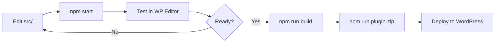

# 🧱 MK Builder

> **Professional WordPress Gutenberg Blocks Plugin** — purpose-built for the MK Ecosystem  
> Enterprise-grade page building blocks for hospitals, clinics, corporate sites, and e-commerce.

[](https://www.gnu.org/licenses/gpl-2.0.html)
[](https://github.com/mawkunnmyat/mk-builder)
[](https://wordpress.org/)
[](https://www.php.net/)
[](https://nodejs.org/)
[](https://developer.wordpress.org/block-editor/)
[](#-block-catalog)
[](https://github.com/mawkunnmyat/mk-builder/releases)
[](https://github.com/mawkunnmyat/mk-builder)

---

## 📋 Table of Contents

- [What's New](#-whats-new)
- [Overview](#-overview)
- [Key Features](#-key-features)
- [Requirements](#-requirements)
- [Quick Start](#-quick-start)
- [Migration from Twork Builder](#-migration-from-twork-builder)
- [Project Structure](#-project-structure)
- [Block Catalog](#-block-catalog)
- [Brand Page Blocks](#-brand-page-blocks-industry-agnostic)
- [Shweghee Reference Site](#-shweghee-reference-site)
- [Available Scripts](#-available-scripts)
- [Development Workflow](#-development-workflow)
- [Block Architecture](#-block-architecture)
- [PHP Render Callbacks](#-php-render-callbacks)
- [Frontend Assets](#-frontend-assets)
- [Security](#-security)
- [Deployment](#-deployment)
- [Troubleshooting](#-troubleshooting)
- [Contributing](#-contributing)
- [Commit Convention](#-commit-convention)
- [Changelog](#-changelog)
- [License & Support](#-license--support)

---

## 🆕 What's New

### ✨ July 11, 2026 — MK Builder Rebrand Release

| Area | Update |
|------|--------|
| 🏷️ **Plugin Identity** | Official rename from `twork-builder` → **`mk-builder`** |
| 📦 **Bootstrap** | New `mk-builder.php` entry point with `MK_BUILDER_*` constants |
| 🐘 **PHP Classes** | All `class-twork-*` render callbacks migrated to `class-mk-*` |
| 🧱 **Block Namespace** | Legacy `twork/*` blocks renamed to `mk/*` where applicable |
| 🔧 **Tooling** | Added `scripts/rebrand-twork-to-mk.mjs` and `scripts/wp-migrate-block-namespace.sh` |
| 📚 **Documentation** | Comprehensive README, migration guide, and commit conventions |

> 🔔 **Upgrading from Twork Builder?** See the [Migration from Twork Builder](#-migration-from-twork-builder) section below.

---

## 🌟 Overview

**MK Builder** is a production-ready WordPress plugin that delivers **270+ custom Gutenberg blocks** for building modern, responsive websites within the MK Ecosystem. It powers hospital portals, corporate marketing sites, pharmacy shops, CSR pages, food & retail brand sites, and specialty department layouts — all editable through the native WordPress Block Editor.

Built with **ES6+**, **SCSS**, **@wordpress/scripts**, and **WordPress best practices**, the plugin is designed for:

- 🏥 **Healthcare & hospital websites** — departments, doctors, health checks, emergency units
- 🥑 **Agrezer / Avocado brand sites** — hero sections, stats, testimonials, shop grids
- 🧈 **Food & retail brand sites** — Shweghee-style home pages with carousels, categories, and reviews
- 🛒 **WooCommerce integration** — pharmacy categories, popular products, shop layouts
- 🏢 **Corporate & CSR pages** — mission/vision, awards, events, initiatives
- 📱 **Fully responsive layouts** — mobile-first SCSS with editor/frontend parity

---

## ✨ Key Features

| Feature | Description |
|---------|-------------|
| 🎨 **270+ Custom Blocks** | Pre-built sections, cards, grids, heroes, FAQs, timelines, and more |
| 🏪 **Brand Page Suite** | Industry-agnostic header, carousels, grids, FAQ, newsletter, and footer blocks |
| 🧪 **Static-to-Block QA** | `shweghee/` reference site for visual parity before WordPress migration |
| 🚀 **Modern Dev Stack** | ES6+, SCSS, Webpack via `@wordpress/scripts` |
| 📦 **Production Builds** | Minified bundles, PHP copy to `build/`, plugin ZIP generator |
| 🔧 **Developer Tooling** | Watch mode, linting, migration scripts, block validation gates |
| 📱 **Responsive by Default** | Mobile-first SCSS with fluid spacing and breakpoint-aware layouts |
| ⚡ **Performance Focused** | Conditional script enqueue, scoped block styles, optimized builds |
| 🧩 **Dynamic PHP Blocks** | Server-side render callbacks for blog, shop, updates, and CPT-driven content |
| 🎯 **Editor Experience** | Dedicated block category, inspector controls, editor-only styles |
| 🗂️ **Deprecated Block Support** | Legacy blocks preserved under `src/deprecated/` for safe migration |

---

## 📦 Requirements

| Dependency | Minimum Version |
|------------|-----------------|
| **WordPress** | 6.0+ |
| **PHP** | 7.4+ |
| **Node.js** | 18.0+ |
| **npm** | 9.0+ |

**Optional integrations:**

- 🛒 **WooCommerce** — required for pharmacy and Agrezer shop blocks
- 📰 **Custom Post Types** — Awards, CSR Initiatives, Emergency Units (included in plugin)

---

## 🚀 Quick Start

### 1️⃣ Clone the Repository

```bash
git clone https://github.com/mawkunnmyat/mk-builder.git
cd mk-builder
```

> 🔗 **Repository:** [mawkunnmyat/mk-builder](https://github.com/mawkunnmyat/mk-builder) — official MK Builder repository.

### 2️⃣ Install Dependencies

```bash
npm install
```

### 3️⃣ Development Mode (Watch)

```bash
npm start
```

Starts the development build with **hot reload** — recompiles automatically on file changes in `src/`.

### 4️⃣ Production Build

```bash
npm run build
```

Builds minified, optimized assets into `build/`. Uses **8 GB Node heap** by default to handle the large block set.

> 💡 **Out of memory?** Run:
> ```bash
> NODE_OPTIONS=--max-old-space-size=8192 npm run build
> ```

### 5️⃣ Create Plugin ZIP

```bash
npm run plugin-zip
```

Generates `../mk-builder.zip` — ready for WordPress upload.

### 6️⃣ Install in WordPress

**Via Admin Dashboard:**

`Plugins → Add New → Upload Plugin → mk-builder.zip → Activate`

**Via WP-CLI:**

```bash
wp plugin install mk-builder.zip --activate
wp plugin activate mk-builder
```

### 7️⃣ Verify Installation

```bash
wp plugin list | grep mk-builder
wp block list --format=table | grep mk/
```

You should see **MK Builder** active and `mk/*` blocks registered in the block list.

---

## 🔄 Migration from Twork Builder

If you are upgrading from the legacy **Twork Builder** plugin, follow this checklist to avoid broken layouts or missing blocks.

### ⚠️ Before You Begin

1. 💾 **Back up** your database and `wp-content/plugins/` directory
2. 🧪 **Test on staging** before applying to production
3. 📸 **Export** critical pages as reusable block patterns (optional safety net)

### 🛠️ Step-by-Step Migration

| Step | Action | Command / Location |
|------|--------|-------------------|
| 1️⃣ | Deactivate old plugin | `wp plugin deactivate twork-builder` |
| 2️⃣ | Install MK Builder | Upload `mk-builder.zip` or clone this repo |
| 3️⃣ | Run block namespace migration | `bash scripts/wp-migrate-block-namespace.sh` |
| 4️⃣ | Activate MK Builder | `wp plugin activate mk-builder` |
| 5️⃣ | Clear all caches | Object cache, page cache, CDN |
| 6️⃣ | Re-save permalinks | `Settings → Permalinks → Save Changes` |
| 7️⃣ | Visual QA | Compare editor + frontend for every critical page |

### 🔁 Namespace Mapping (Legacy → MK)

| Legacy (Twork) | New (MK Builder) |
|----------------|------------------|
| `twork-builder.php` | `mk-builder.php` |
| `TWORK_BUILDER_*` constants | `MK_BUILDER_*` constants |
| `class-twork-award.php` | `class-mk-award.php` |
| `twork/header` block | `mk/mk-header` block |
| `twork/nav-item` block | `mk/mk-nav-item` block |
| `@twork-builder/editor-utils` | `@mk-builder/editor-utils` |

### 🤖 Automated Rebrand Script

For developers migrating a fork or custom branch:

```bash
node scripts/rebrand-twork-to-mk.mjs
npm run build
```

> ⚡ The script performs ordered, safe replacements while preserving `tworksystem.com` domain references.

---

## 📁 Project Structure

```
mk-builder/
├── 📂 src/                          # Block source (ES6, SCSS, block.json)
│   ├── agrezer-*/                   # Agrezer / Avocado brand blocks
│   ├── health-check-*/              # Health check package blocks
│   ├── em-*/                        # Emergency department blocks
│   ├── rad-*/                       # Radiology & imaging blocks
│   ├── phy-*/                       # Physiotherapy blocks
│   ├── ph-*/                        # Pharmacy / WooCommerce blocks
│   ├── csr-*/                       # CSR & community blocks
│   ├── brand-*/                     # Industry-agnostic brand page blocks
│   ├── hero-banner-*/               # Hero carousel parent + slide child
│   ├── image-card-*/                # Services / promo carousel blocks
│   ├── category-card-*/             # Product category grid blocks
│   ├── logo-showcase-*/             # Partner / certification logo strip
│   ├── news-card-*/                 # Blog / news card grid blocks
│   ├── review-*/                    # Testimonial carousel blocks
│   ├── faq-accordion-*/             # Accessible FAQ accordion blocks
│   ├── subscribe-bar/               # Newsletter / email subscribe strip
│   ├── split-promo-section/         # App download / split CTA section
│   ├── deprecated/                  # Legacy blocks (migration-safe)
│   └── global.scss                  # Shared global stylesheet
├── 📂 shweghee/                     # Static reference site (block migration QA)
│   ├── src/components/              # One section per folder (HTML/CSS/JS)
│   ├── src/pages/                   # Home, shop, about, blog, and more
│   ├── src/scripts/data/            # Mock JSON content (future block attrs)
│   └── docs/                        # Architecture + block mapping guides
├── 📂 build/                        # Compiled output (generated — do not edit)
├── 📂 assets/
│   ├── images/                      # Static image assets
│   └── js/                          # Frontend init scripts (conditionally enqueued)
├── 📂 includes/                     # PHP classes & render callbacks
│   ├── class-mk-award.php
│   ├── class-mk-blog-section.php
│   ├── class-mk-csr-initiative.php
│   ├── class-mk-em-units-section.php
│   ├── class-mk-ph-shop-category-section.php
│   ├── class-mk-ph-popular-products-section.php
│   ├── class-mk-agrezer-shop-grid-section.php
│   ├── class-mk-phy-facilities-section.php
│   └── class-mk-updates-section.php
├── 📂 scripts/                      # Dev & migration utilities
├── 📄 mk-builder.php                # Main plugin bootstrap
├── 📄 webpack.config.js             # Custom Webpack / Sass config
├── 📄 create-zip.sh                 # Production ZIP creator
├── 📄 package.json
└── 📄 README.md
```

---

## 🧩 Block Catalog

Blocks are registered automatically from `build/` and appear under **"MK Builder Blocks"** in the Gutenberg inserter.

### 🥑 Agrezer / Avocado Brand

Hero sections, about pages, stats, testimonials, partners, process flows, shop grids, blog layouts, contact cards, greener/sustainability sections, and why-choose layouts.

```
agrezer-hero-section · agrezer-about-section · agrezer-stats-section
agrezer-testimonials-section · agrezer-partners-section · agrezer-shop-grid-section
agrezer-why-choose-section · agrezer-voices-section · agrezer-blog-section · …
```

### 🏥 Hospital & Clinical

Department layouts, centre pages, doctor directories, emergency units, neuro/radiology/physio sections, health check packages, and patient guides.

```
emergency-hero · doctor-search-filter-section · health-check-packages-section
neuro-centre-section · rad-stats-section · phy-conditions-section · paediatrics-hero · …
```

### 🛒 Pharmacy & E-Commerce

WooCommerce-powered shop categories, popular products, and Agrezer product grids.

```
ph-shop-category-section · ph-popular-products-section · agrezer-shop-grid-section
```

### 🌍 CSR & Corporate

Awards, initiatives, events, moments gallery, mission/vision, accreditations, and team sections.

```
csr-initiatives-section · csr-events-section · csr-stats-section
accreditation-section · mission-vision-grid · team-members-grid · …
```

### 🧱 Layout & Utility

Containers, page heroes, timelines, story grids, feature sections, navigation, and shared structural blocks.

```
container · page-hero · timeline · story-grid · features-section · mk-nav-item · …
```

---

## 🏪 Brand Page Blocks (Industry-Agnostic)

A complete **home-page block suite** with sector-neutral naming (`mk/*`). Designed for food, retail, healthcare, and corporate brand sites — originally scaffolded from the **Shweghee / Shwe Myanmar** reference implementation.

### 🧭 Navigation & Shell

| Block | Slug | Description |
|-------|------|-------------|
| 🏷️ Brand Header | `mk/brand-header` | Logo, hotline, search toggle, sticky header, mobile menu |
| 🔗 Brand Nav Item | `mk/brand-nav-item` | Child nav link with optional dropdown |
| 🦶 Brand Footer | `mk/brand-footer` | Multi-column footer shell |
| 📇 Footer Info Card | `mk/brand-footer-info-card` | Contact / address info card child |
| 📂 Footer Column | `mk/brand-footer-column` | Link list column child |

### 🎠 Hero & Carousels

| Block | Slug | Description |
|-------|------|-------------|
| 🖼️ Hero Banner Carousel | `mk/hero-banner-carousel` | Fade hero slider with autoplay, arrows, and dots |
| 🎞️ Hero Banner Slide | `mk/hero-banner-slide` | Single hero slide (eyebrow, title, CTA, image) |
| 🃏 Image Card Carousel | `mk/image-card-carousel` | Services / features horizontal carousel |
| 🃏 Image Card Slide | `mk/image-card-slide` | Individual carousel card child |

### 📊 Content Grids & Social Proof

| Block | Slug | Description |
|-------|------|-------------|
| 🔢 Numbered Features Grid | `mk/numbered-features-grid` | "Why choose us" numbered feature grid |
| 🔢 Numbered Feature Item | `mk/numbered-feature-item` | Single numbered feature child |
| 🗂️ Category Card Grid | `mk/category-card-grid` | Product / service category card grid |
| 🗂️ Category Card | `mk/category-card` | Individual category card child |
| 🏢 Logo Showcase Section | `mk/logo-showcase-section` | Partner / certification logo strip |
| 🏢 Logo Showcase Item | `mk/logo-showcase-item` | Single logo child |
| 📰 News Card Grid | `mk/news-card-grid` | Blog / news article card grid |
| 📰 News Card | `mk/news-card` | Single news card child |
| ⭐ Review Carousel | `mk/review-carousel` | Customer testimonial carousel |
| ⭐ Review Card | `mk/review-card` | Single review card child |

### 🎯 Conversion & Engagement

| Block | Slug | Description |
|-------|------|-------------|
| 📱 Split Promo Section | `mk/split-promo-section` | App download / split-layout CTA with features |
| ❓ FAQ Accordion Section | `mk/faq-accordion-section` | Accessible FAQ accordion with FAQPage schema |
| ❓ FAQ Accordion Item | `mk/faq-accordion-item` | Single FAQ question/answer child |
| ✉️ Subscribe Bar | `mk/subscribe-bar` | Email newsletter strip with honeypot anti-spam |

### 🏠 Recommended Home Page Stack

```
brand-header → hero-banner-carousel → image-card-carousel → numbered-features-grid
→ category-card-grid → logo-showcase-section → news-card-grid → review-carousel
→ split-promo-section → faq-accordion-section → subscribe-bar → brand-footer
```

> 📌 **Tip:** Run `npm run add-block-examples` to scaffold block example metadata across the codebase.

---

## 🧈 Shweghee Reference Site

The `shweghee/` directory is a **modular static HTML/CSS/JS reference site** used for design QA and WordPress block migration. It mirrors the Farmart Home Business Style 7 layout, adapted for **Shwe Myanmar Foodstuff Industry** branding.

### 📄 Available Pages

| Page | Path | Purpose |
|------|------|---------|
| 🏠 Home | `shweghee/src/pages/home.html` | Full home page section stack |
| 🛒 Shop | `shweghee/src/pages/shop.html` | E-commerce listing layout |
| ℹ️ About | `shweghee/src/pages/about.html` | Brand story page |
| 📞 Contact | `shweghee/src/pages/contact.html` | Contact form layout |
| 📰 Blog | `shweghee/src/pages/blog.html` | Article listing |
| 📝 Blog Single | `shweghee/src/pages/blog-single.html` | Single article template |
| 🛍️ Product | `shweghee/src/pages/product.html` | Product detail page |
| ❓ FAQ | `shweghee/src/pages/faq.html` | FAQ page |
| 💼 Careers | `shweghee/src/pages/careers.html` | Careers listing |
| 🏭 Wholesale | `shweghee/src/pages/wholesale.html` | B2B inquiry page |
| ✅ Quality | `shweghee/src/pages/quality.html` | Quality assurance page |
| 📍 Where to Buy | `shweghee/src/pages/where-to-buy.html` | Store locator |
| 🔒 Privacy | `shweghee/src/pages/privacy.html` | Privacy policy |
| ♿ Accessibility | `shweghee/src/pages/accessibility.html` | Accessibility statement |
| 🚫 404 | `shweghee/src/pages/404.html` | Not found page |

### 🚀 Run Locally

ES modules require a local server (do not open HTML via `file://`):

```bash
cd shweghee/src
python3 -m http.server 8080
# Home: http://localhost:8080/pages/home.html
# Shop: http://localhost:8080/pages/shop.html
```

### 🔄 Static → Block Migration Workflow

1. 🎨 **Design** — Build or refine section in `shweghee/src/components/<section>/`
2. 📋 **Map** — Add row to `shweghee/docs/block-mapping.md` with `data-block` slug
3. 🧱 **Scaffold** — Create matching block in `src/<block-name>/`
4. 🎨 **Port styles** — Move `*.css` → block `style.scss`
5. ⚡ **Port scripts** — Move `init*` logic → block `view.js`
6. 📝 **Attributes** — Replace `*.mock.json` fields with `block.json` attributes
7. ✅ **QA** — Visual compare static page vs. WordPress editor + frontend

See `shweghee/docs/architecture.md` for component contracts and `data-*` attribute conventions.

---

## 🛠️ Available Scripts

| Command | Description |
|---------|-------------|
| `npm start` | 🔁 Development mode with watch & hot reload |
| `npm run build` | 📦 Production build (minified, PHP copied to `build/`) |
| `npm run plugin-zip` | 🗜️ Build + create WordPress-ready ZIP |
| `npm run zip` | 🗜️ Create ZIP only (requires prior build) |
| `npm run lint:js` | 🔍 Lint JavaScript with WordPress standards |
| `npm run lint:css` | 🎨 Lint SCSS/CSS with stylelint |
| `npm run format` | ✨ Auto-format JavaScript files |
| `npm run packages-update` | ⬆️ Update `@wordpress/*` packages |
| `npm run add-block-examples` | 📝 Add block example metadata |
| `npm run gate-inspector-is-selected` | ✅ Validate inspector `isSelected` usage |
| `npm run migrate-stable-block-props` | 🔄 Migrate stable block prop patterns |

---

## 🔄 Development Workflow



1. ✏️ **Edit** block files in `src/<block-name>/`
2. 🔁 **Watch** with `npm start` during development
3. 🧪 **Test** in the WordPress Block Editor and on the frontend
4. 📦 **Build** with `npm run build` before release
5. 🗜️ **Package** with `npm run plugin-zip` for deployment
6. 🚀 **Deploy** via WordPress admin or WP-CLI

---

## 🏗️ Block Architecture

Each block in `src/` follows a consistent, WordPress-standard structure:

```
src/my-block/
├── block.json          # 📋 Metadata, attributes, supports, asset handles
├── index.js            # 🔌 Block registration entry point
├── edit.js             # ✏️  Editor component (React)
├── save.js             # 💾 Frontend save output (or null for dynamic blocks)
├── style.scss          # 🎨 Frontend styles
├── editor.scss         # 🖥️  Editor-only styles (optional)
├── view.js             # ⚡ Frontend JavaScript (optional)
└── render.php          # 🐘 Server-side render (dynamic blocks only)
```

### Build Pipeline

`@wordpress/scripts` + custom `webpack.config.js`:

- ✅ Compiles SCSS → CSS with modern Sass API
- ✅ Bundles JavaScript via Webpack
- ✅ Minifies with Terser (`parallel: false` for memory safety)
- ✅ Copies `render.php` to `build/` via `WP_COPY_PHP_FILES_TO_DIST=1`
- ✅ Emits shared `build/global.css` from `src/global.scss`
- ✅ Generates source maps in development mode

---

## 🐘 PHP Render Callbacks

Dynamic blocks with server-side rendering live in `includes/`:

| Class | Purpose |
|-------|---------|
| `class-mk-award.php` | 🏆 Award custom post type & block support |
| `class-mk-blog-section.php` | 📰 Blog layout with featured posts, grid, sidebar |
| `class-mk-csr-initiative.php` | 🌱 CSR initiative post meta |
| `class-mk-em-units-section.php` | 🚑 Emergency units from posts |
| `class-mk-ph-shop-category-section.php` | 🛒 Pharmacy categories (WooCommerce) |
| `class-mk-ph-popular-products-section.php` | ⭐ Popular products (WooCommerce) |
| `class-mk-agrezer-shop-grid-section.php` | 🥑 Agrezer shop grid layout |
| `class-mk-phy-facilities-section.php` | 💪 Physio facilities from posts |
| `class-mk-updates-section.php` | 📢 Hospital news & updates section |

Blocks are auto-registered by scanning `build/*/block.json` in `mk-builder.php`.

---

## ⚡ Frontend Assets

Frontend JavaScript is **registered globally** and **enqueued conditionally** per page in `mk-builder.php`:

```
assets/js/
├── jivaka-header-init.js       # Header navigation
├── hero-new-init.js            # Hero animations
├── doctor-directory-init.js    # Doctor search/filter
├── csr-initiatives-init.js     # CSR interactions
├── testimonial-init.js         # Testimonial carousels
└── … (30+ init scripts)
```

**CDN libraries** (loaded when needed):

- 🎠 **Swiper.js** — carousels & sliders
- 🎬 **GSAP** — scroll & entrance animations
- 🎨 **Font Awesome** — icon library
- 🧰 **UIKit** — UI framework components

---

## 🔒 Security

MK Builder follows WordPress security best practices across PHP, JavaScript, and the block editor.

| Practice | Implementation |
|----------|----------------|
| 🛡️ **Direct Access Guard** | `ABSPATH` check in all PHP entry points |
| 🧼 **Output Escaping** | `esc_html()`, `esc_attr()`, `esc_url()` in render callbacks |
| 🔐 **Input Sanitization** | `sanitize_*` functions for all user-facing attributes |
| 🍯 **Anti-Spam** | Honeypot field on `mk/subscribe-bar` block |
| ♿ **Accessible Markup** | ARIA roles on FAQ accordion, keyboard-navigable carousels |
| 📦 **Scoped Assets** | Conditional script enqueue — no global pollution |
| 🚫 **No Secrets in VCS** | `.env`, SSH keys, and credentials excluded from repository |

### 🧪 Security Checklist for Contributors

- [ ] Never commit API keys, database credentials, or `.env` files
- [ ] Sanitize all `block.json` attributes before rendering in PHP
- [ ] Use WordPress nonces for any custom AJAX endpoints
- [ ] Validate and escape all dynamic HTML in `render.php` files
- [ ] Run `npm run lint:js` before opening a pull request

---

## 🚢 Deployment

### Development / Staging

```bash
npm run build
# Copy plugin folder or symlink into wp-content/plugins/
```

### Production Release

```bash
npm run plugin-zip
# Upload ../mk-builder.zip to production WordPress
```

### Checklist Before Release

- [ ] ✅ `npm run build` completes without errors
- [ ] ✅ `npm run lint:js` and `npm run lint:css` pass
- [ ] ✅ Blocks render correctly in editor and frontend
- [ ] ✅ Dynamic blocks tested with live post/product data
- [ ] ✅ Responsive layouts verified (mobile, tablet, desktop)
- [ ] ✅ Plugin ZIP installs cleanly on a fresh WordPress instance

---

## 🔧 Troubleshooting

### ❌ Build fails or runs out of memory

```bash
node --version          # Must be >= 18.0.0
rm -rf node_modules package-lock.json && npm install
NODE_OPTIONS=--max-old-space-size=8192 npm run build
```

### ❌ Blocks not appearing in the editor

1. Ensure `build/` exists — run `npm run build`
2. Check WordPress debug log: `WP_DEBUG_LOG` in `wp-config.php`
3. Validate `block.json` files are valid JSON
4. Clear WordPress object/page cache

### ❌ Styles not loading on frontend

1. Confirm SCSS is imported in the block's `index.js` or `block.json`
2. Re-run `npm run build`
3. Check browser Network tab for 404 on CSS handles
4. Verify `block.json` `style` / `editorStyle` paths match built filenames

### ❌ WooCommerce blocks show empty data

1. Confirm WooCommerce is installed and activated
2. Ensure products/categories exist in the WooCommerce catalog
3. Check PHP render callback logs in `wp-content/debug.log`

---

## 🤝 Contributing

We welcome contributions! Please follow this workflow:

1. 🍴 **Fork** the repository
2. 🌿 **Create** a feature branch: `git checkout -b feature/my-feature`
3. ✍️ **Commit** with the [commit convention](#-commit-convention) below
4. 📤 **Push** to your fork: `git push origin feature/my-feature`
5. 🔀 **Open** a Pull Request with a clear description and test plan

---

## 📝 Commit Convention

This project follows **[Conventional Commits](https://www.conventionalcommits.org/)** with a date-stamped prefix:

```
<type>: DDMMYYYY - <professional description>
```

| Type | When to Use | Example |
|------|-------------|---------|
| `feat` | ✨ New feature or enhancement | `feat: 11072026 - add brand page Gutenberg block suite for retail sites` |
| `fix` | 🐛 Bug fix | `fix: 11072026 - restore FAQ accordion keyboard navigation on mobile` |
| `docs` | 📚 Documentation only | `docs: 11072026 - expand README with brand blocks catalog and shweghee guide` |
| `refactor` | ♻️ Code restructure (no behavior change) | `refactor: 11072026 - migrate plugin namespace from twork to mk` |
| `style` | 💅 Formatting / SCSS-only (no logic change) | `style: 11072026 - normalize hero section typography tokens` |
| `chore` | 🔧 Tooling, deps, config | `chore: 11072026 - bump @wordpress/scripts to v27` |
| `perf` | ⚡ Performance improvement | `perf: 11072026 - defer non-critical frontend init scripts` |
| `test` | 🧪 Tests | `test: 11072026 - add block registration smoke tests` |

**Rules:**

- ✅ Use lowercase type prefix
- ✅ Use present tense, imperative mood ("add", "fix", "update" — not "added", "fixed")
- ✅ Keep the first line under 72 characters when possible
- ✅ Add body paragraphs for complex changes if needed

---

## 📅 Changelog

### 🚀 `1.0.0` — July 11, 2026

- 🏷️ **Rebrand:** Full migration from Twork Builder to MK Builder
- 📦 **Plugin:** New `mk-builder.php` bootstrap with `MK_BUILDER_*` constants
- 🐘 **PHP:** Renamed all `class-twork-*` to `class-mk-*` render callbacks
- 🧱 **Blocks:** Updated 270+ block namespaces, attributes, and asset handles
- 🏪 **Brand Suite:** Industry-agnostic `mk/*` home page block stack
- 🧈 **Shweghee:** Static reference site for design-to-block migration QA
- 🔧 **Scripts:** Rebrand automation (`rebrand-twork-to-mk.mjs`) and WP migration shell script
- 📚 **Docs:** Professional README with migration guide, security section, and changelog
- 🧹 **Cleanup:** Removed 35 root-level static HTML mockups and non-essential assets from VCS

### 📦 Earlier Releases

See [Git commit history](https://github.com/mawkunnmyat/mk-builder/commits/main) for the full development timeline including brand blocks, Agrezer suite, and hospital/clinical block additions.

---

## 📜 License & Support

### License

This project is licensed under the **GPL v2 or later** — see [LICENSE](LICENSE) for details.

### Support

**Maw Kunn**

- 🐙 **GitHub:** [https://github.com/mawkunnmyat](https://github.com/mawkunnmyat)
- 🔗 **Plugin URI:** [https://github.com/mawkunnmyat/mk-builder](https://github.com/mawkunnmyat/mk-builder)
- 📦 **Repository:** [https://github.com/mawkunnmyat/mk-builder](https://github.com/mawkunnmyat/mk-builder)

### Author & Maintainer

**Maw Kunn Myat** — [@mawkunnmyat](https://github.com/mawkunnmyat)  
📧 [mapoeeiphyu2017.miitinternship@gmail.com](mailto:mapoeeiphyu2017.miitinternship@gmail.com)  
💼 Principal Developer — Maw Kunn

---

<div align="center">

**Maw Kunn**

© 2026 Maw Kunn. All rights reserved.

*Built with ❤️ for the MK Ecosystem*

</div>
